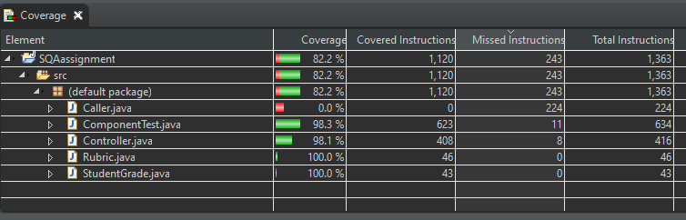
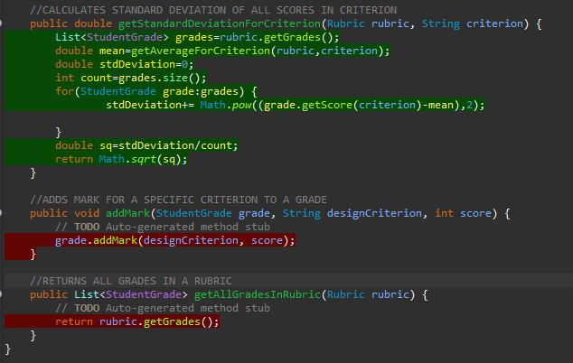
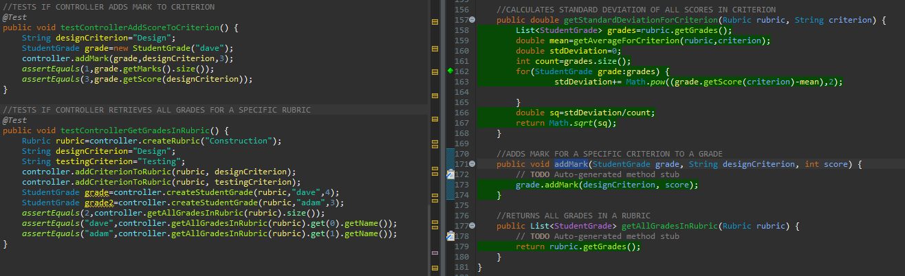
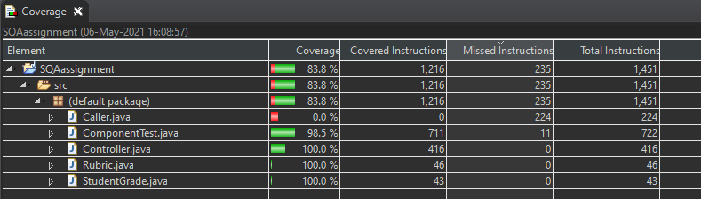

# **Software Quality Assurance Project Plan**
## Introduction
As part of my final Software Quality Assurance Assignment we have been asked to implement an example software project for an organisation. I will be implementing a component to store information about student grades.  
The project will demonstrate the following topics:  
- Scrum sprint backlog and task estimation
- Unit testing and Test-Driven development
- Test coverage metric
- Team version-control 
- Code-review checklist

## Sprint Backlog and Task Estimation
Each Task related to coding involves coding the feature along with the appropriate tests to ensure the functionality is working correctly 
### Create StudentGrade Class (Size: XS)
### Create Rubric Class (Size: S)
- Method to add a Criterion (Size: XS)
- Method to add a Student Grade (Size: XS)           
### Create Controller Class (Size: L)
- Method to create a Rubric (Size: XS)
- Method to add a Criterion to a Rubric (Size: XS)
- Method to get a list of all Rubrics (Size: XS)
- Method to get specific Rubric by name (Size: S)
- Method to create new StudentGrade (Size: XS)
- Method to add a score for a particular criterion to a grade (Size: S)
- Method to get all StudentGrades associated with a specific Rubric (Size: S)
- Methods to provide summary calculations like average, standard deviation, minimum and maximum score for a Rubric across all grades (Size: M)
- Methods to provide summary calculations like average, standard deviation, minimum and maximum score for a specific Criterion of a Rubric (Size: M)
### Investigate Code Coverage Tool (Size: M)
- Select tool (Size: S)
- Document how to run tool (Size: XS)
- Identify gaps in code coverage and make changes (Size: S)
### Write Code Review Documentation (Size: S)

## Task Estimation Justification
I used **T-Shirt sizes** for estimating each of the tasks in my sprint backlog because it is a simple, easy to use technique and it allowed me to estimate the tasks without putting a specific time on them which was helpful because I dont have a vast amount of experience developing components through Test Driven Development so I was finding it difficult to put an exact time on each task.  

  

I labelled what I thought would be the simplest tasks **XS** which would be a method to create a new Rubric or a new StudentGrade, methods that should only require one or two lines of code.   I labelled tasks **S** if I felt they would be relatively easy to implement but require a little more thinking than a simple method call. If you compare the Method to create a rubric **(XS)** to the Method to get specific Rubric by name **(S)** it is clear to see the latter would require a bit more computation but would still be relatively simple.    **M** was given to tasks that consisted of a number of smaller tasks like providing summary calculations or investigating the code coverage, both tasks consisting of a number of smalller tasks that together make up a medium weighted task.    I labelled the tasks that a felt required a substantial amount of effort **L** in this case **L** carrys the most weight in the sprint backlog and this is the task that consists of a large number of tasks which are labelled **XS**, **S** and **M** which is creating the controller task. Comparing this task with the task of investigating the code coverage tool **(M)** it is easy to see the difference in weight with the latter container a lot fewer tasks and each of them being labelled **S** and **XS**.

## Velocity Metric
**Velocity** is a good metric for measuring the rate at which scrum teams regularly deliver working products and product functionality. This can be very useful in many ways including **predicting how much work will get done** in a sprint and **judging the time it will take to complete certain pieces of a product**.  
In order to calculate sprint velocity you must:
- Count the story points completed in each sprint
- Calculate the average of completed story points accross a number of sprints  

  

Note that I have estimated the tasks above tasks using T-shirt sizes. In this case in order to calculate the sprint velocity you would need to assign numberic values to the sizes.
Once you have a general idea of the amount of work the team can do in a certain amount of time, sprint planning becomes a lot easier and a the task estimates get more accurate.  

## Code Coverage Tool
To ensure that I had sufficient unit tests in place for the software component I created, I used the code coverage tool known as Jacoco.  
"JaCoCo is a free code coverage library for Java, which has been created by the EclEmma team based on the lessons learned from using and integration existing libraries for many years."[1]  

  

  
It is really easy to install and is a very efficient way of helping you spot gaps in your test coverage.  
The editor I use is Eclipse IDE, Jacoco can be installed through Eclispe by following the steps below.  

### Installation Instructions
- Once in Eclipse click **Help** near the top left of the screen.
- Navigate to **Eclipse Marketplace** in the dropdown menu.
- Type **EclEmma** into the search box and hit enter.

  

  

### How To Use
In order to run the tool then, do the following
- Right click your project.
- Navigate to **Coverage as**.
- Click **JUnit Test**.

### First Run  
   
As you can see from the screenshot above, it gives you details regarding the Code Coverage Percentage as well as the number of Covered Instructions, Missed Instructions and Total Instructions of both the project as a whole and the individual files in the project. 

   

The screenshots above were taken after the first time the tool was run on my project.  
It is easy to identify which parts of the code are being tested and which parts are not.  
The code that **is tested** is clearly highlighted in **Green**.
The code that is **not tested** is clearly highlighted in **Red**.   
Note the overall coverage of my project is **82.2%**, this is quite high but realistically it is actually much higher because I've included a Caller class in my project to give a full demonstration of how the controller component is used, this code shouldn't need to be tested as it is only using the methods of the controller class which I have already provided tests for.  

### Second Run
The two methods **addMark** and **getAllGradesInRubric** had been identified by the code coverage tool as not being tested so in light of this I added two more tests and ran the tool again.  
This is the result I got. 

 
 

The methods that were previously highlighted red are now green.  
The Coverage for the component class has also moved to 100%. 

## Code-Review Checklist

  

  
It is important to review the code changed on Pull Requests instead of clicking approve immediately and passing it off to the next person to review or merging it straight away. If code is not properly reviewed a project can get messy very quickly and if something breaks it can be quite time consuming searching through the code to find the problem. For this reason I have provided a short checklist below of things to look out for when your are reviewing code on a pull request.  

- Is there sufficient unit testing for the code that is being added?
- Does the code follow basic coding standards like CamelCase naming conventions?
- Is the code well spaced out and easy to read?
- Is there sufficient comments explaining the code so its easy for other programmers to understand?
- Is the code seperated out into appropriate classes or is it all jumbled up into one big class?  

You should ask yourself these questions when reviewing code and be sure to voice your concern by commenting on the Pull Request if any of these things are not being followed as displayed <a href="https://github.com/DavidM-GitHub/SQAassignment/pull/3#pullrequestreview-653259799">here</a>.  

## Retrospective
### What went well
- Followed git flow process relatively well and gained some good experience from it.
- Gained a much better undertstanding of Test Driven Development.
- Achieved good test coverage according to the the coverage tool used.
- Code reviews on Pull Requests were thorough and identified anything that needed to be changed.
### What I would do differently
- Spend more time on task estimation as some of the tasks took a bit longer than expected.  

## References
[1] https://www.eclemma.org/jacoco/

 

